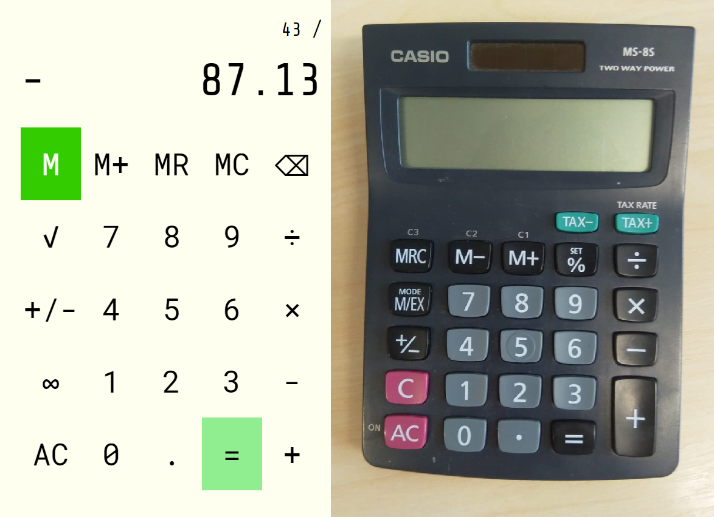

# Another calculator

> This is another JavaScript calculator. It is modelled on a real calculator and more or less works like a real calculator, with a couple of flashy / temperamental additions.

You can see it here on the left - it is based on a real calculator that is similar but not identical to this other one I just found at work, on the right. It does regular functions including square root and the normal operators. It uses memory to overcome the limitations of Immediate Execution Logic, for example that `3 + 5 x 6 - 2 / 4` produces `11.5` rather than `32.5`.

## Design process
I started by trying to emulate it 100%, and soon found limitations e.g. processing a double negative, making the memory function intuitive